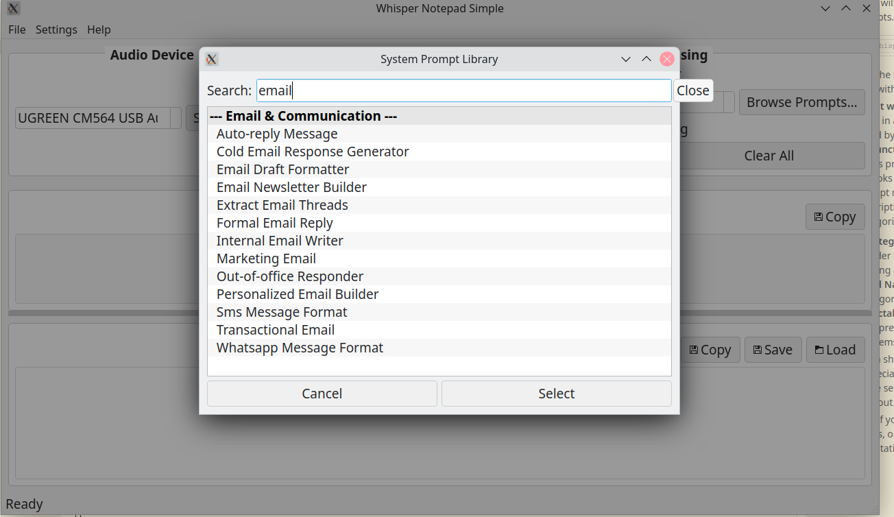

#  Linux Whisper Transcription Notepad - Simple Version 

 

 This version of a speech to text transcription notepad for Linux is a simplified version of a previous configuration that I created also using AI code generation. 

 This streamlined version of the previous app dispenses with the large library of system prompts in order to provide a more simple utility which simply applies one default text transformation prompt in order to lightly clean up the text received from Whisper. 

 The UI features the ability to save your Open AI API key, as well as set a default input microphone device, both of with persist in a simple local memory file. There is the option to apply the post recording processing or you can choose not to apply it by unticking the box. 

 The arrow transcription populates into the first window and the cleaned up transcription into the second. In favor of simplicity, in this version, the ability to manually go from the 1st to the 2nd stages was dispensed with (in other words; you cannot manually initiatiate the cleanup process after having initially chosen not to engage it). 

 This utility works well to provide affordable speech to text translation suitable for any purpose at all. I use it to capture prompts using my voice and use the light cleanup utility to make them more intelligible and easier to parse for AI tools. 

 As it uses the Open AI API and not a locally hosted Whisper model, it does incur API charges. But these are quite reasonable, and it also alleviates the issue of requiring any kind of performant GPU hardware, as the speech to text does not run locally.

## Features

- **Audio Recording**: Select your audio input device and record with simple controls
- **Whisper Transcription**: Transcribe your recordings using OpenAI's Whisper API
- **Optional Text Cleanup**: Apply basic text formatting and cleanup using GPT (can be toggled on/off)
- **Clipboard Integration**: Easily copy both raw and cleaned transcriptions
- **File Operations**: Save and load transcriptions

## Installation

1. Clone this repository:
   ```
   git clone https://github.com/yourusername/Whisper-Notepad-Simple.git
   cd Whisper-Notepad-Simple
   ```

2. Install the required dependencies:
   ```
   pip install -r requirements.txt
   ```

3. Set your OpenAI API key:
   - Either set it as an environment variable: `export OPENAI_API_KEY=your-api-key`
   - Or enter it in the application via Settings > Set OpenAI API Key

## Usage

1. Run the application:
   ```
   python whisper_notepad_simple.py
   ```

2. Select your audio input device from the dropdown menu

3. Use the recording controls:
   - **Record**: Start recording audio
   - **Pause/Resume**: Pause or resume the current recording
   - **Stop**: Stop recording and prepare for transcription
   - **Stop & Transcribe**: Stop recording and immediately start transcription (combines two steps into one)
   - **Clear**: Clear the current recording

4. Click **Transcribe** to process your recording with Whisper API (or use the Stop & Transcribe button to do both steps at once)

5. Toggle the **Apply Text Cleanup** checkbox to control whether GPT cleanup is applied to your transcription

6. Use the copy buttons to copy text to clipboard or save your notes using the Save button

## Requirements

- Python 3.8+
- PySide6
- sounddevice
- soundfile
- openai
- numpy

## License

This project is open source and available under the [MIT License](LICENSE).

## Acknowledgements

This is a simplified version of the original Whisper Notepad application, focused on core functionality.
